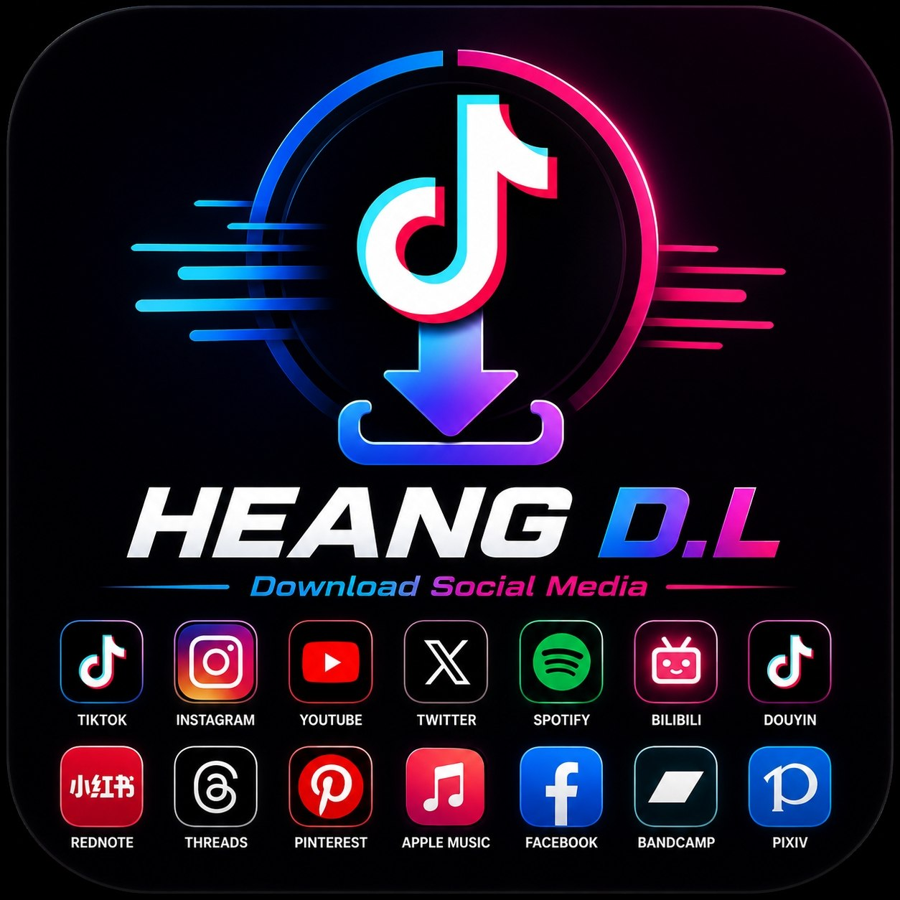
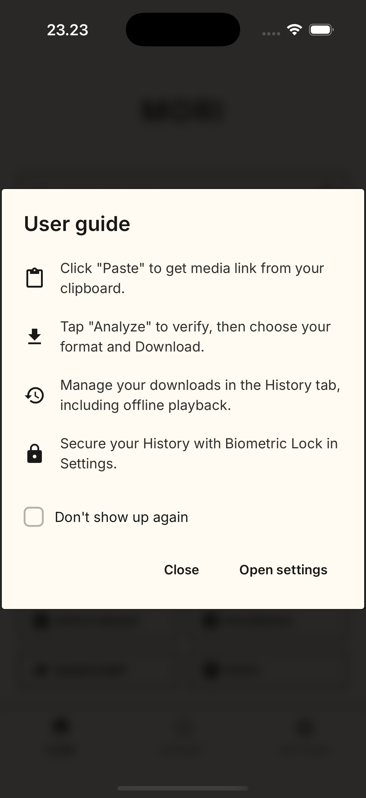
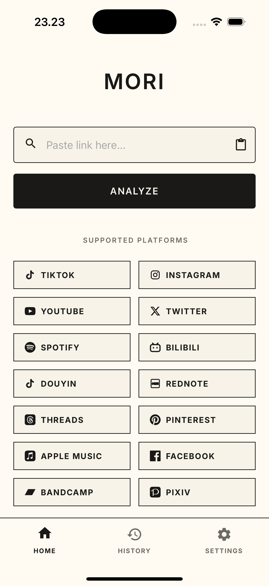
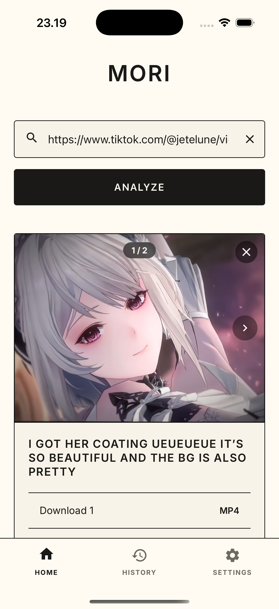
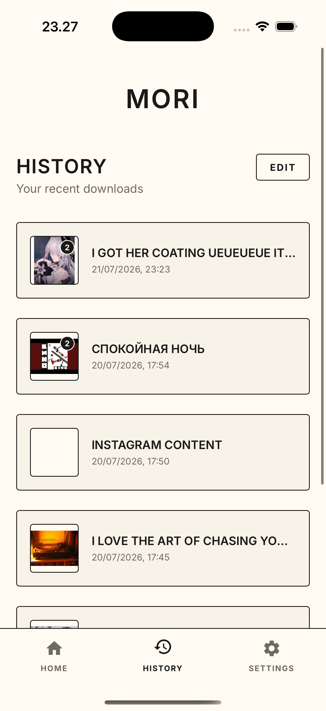
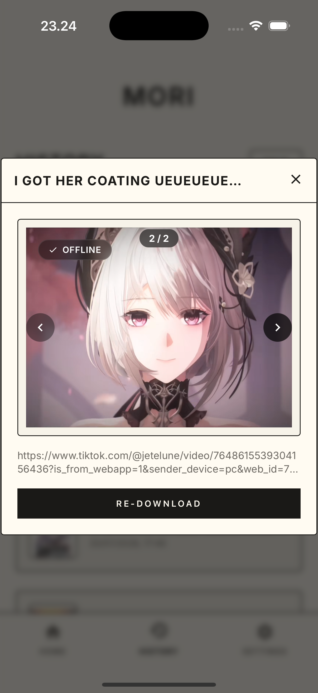
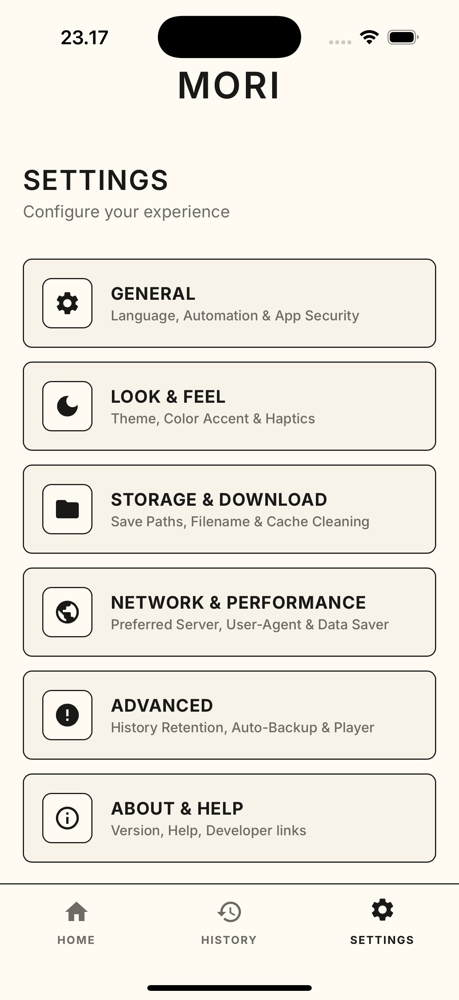

<p align="center">
  
</p>

<h1 align="center">HEANG D.L</h1>

<p align="center">
  
  
  
  
  
  
</p>

<div align="center">

HEANG D.L is a fast and simple downloader for saving videos, photos, and music from 14 popular social media apps. Everything works directly on your device without any external servers or tracking — giving you total privacy and zero ads.

</div>

## 📸 Screenshots

<p align="center">
  
  
  
</p>
<p align="center">
  
  
  
</p>

# HEANG D.L

HEANG D.L (HEANGG-dl) is a cross-platform media downloader and manager web app with optional native wrappers (Capacitor for mobile and Tauri for desktop). It provides a web UI for extracting media (images, audio, video) from various social / media platforms, includes a proxy server for referer bypassing, supports local downloads on mobile/desktop, PDF export for image galleries, and other convenience features.

This repository contains a lightweight Express proxy server (server.js), a static web frontend (public/), and tools to build an Android APK via GitHub Actions. The app is optimized to run as a Progressive Web App (PWA) and can be packaged using Capacitor (Android/iOS) or Tauri (desktop) for native integrations.

Table of Contents
- Features
- Repository layout
- Quick start (web)
- Development (frontend + server)
- Running locally
- Building Android APK (GitHub Actions)
- Packaging for native (Capacitor / Tauri)
- Configuration
- Contributing
- License

Features
- Extract and preview downloadable media (images, audio, video) from many platforms.
- Gallery PDF export (client-side, with image optimization)
- Native file downloads and progress UI (Capacitor / Tauri integrations)
- Proxy endpoints to bypass referer restrictions when loading remote media
- Smart filename templating and auto-folder organization
- Data-saver mode (show placeholders instead of heavy previews)
- Share button and handy UI utilities

Repository layout
- .github/workflows/build-apk.yml - GitHub Actions workflow to build an Android APK
- server.js - Express server that serves static frontend and mounts proxy routes
- proxy.js (or ./proxy) - Proxy router used by the server (mounted at /api and fallback)
- public/ - Frontend static site (HTML/CSS/JS). Main UI lives under public/js/
- assets/ - Static assets used by the frontend

Quick start (web)
1. Clone the repository:
   git clone https://github.com/henghengkh255-art/HEANGG-dl.git
   cd HEANGG-dl

2. Install dependencies:
   npm install

3. Start the server:
   node server.js

4. Open the web app in your browser:
   http://localhost:3000

Development
- Frontend
  - The frontend source is served from `public/`. Edit JS under `public/js/` and static assets under `public/`.
  - The UI implements media preview, download handling, PDF export and interactions with native layers when running under Capacitor or Tauri.

- Server / Proxy
  - The Express server is defined in `server.js`. Proxy routes are mounted from `./proxy` and exposed under `/api` and directly as fallback.
  - The proxy endpoints help bypass cross-origin / referer restrictions and are used by the web client when running in browser-only environments.

Running locally (detailed)
1. Ensure Node.js (v16+) is installed. Recommended Node.js 18+ or 20 for parity with CI.
2. Install dependencies: `npm install`
3. Start the server: `node server.js`
4. By default the app listens on port 3000 (configurable via `PORT` environment variable).

Building Android APK (GitHub Actions)
There's a ready GitHub Actions workflow at `.github/workflows/build-apk.yml` that automates building an Android debug APK. Key points:
- Triggers: push/pull_request to `main` or `master`, and manual `workflow_dispatch`.
- Installs Node.js 20, Java (Zulu) 21, Android SDK, runs `npm install`, initializes Capacitor if `android/` is missing, syncs, generates icons, then runs Gradle `./gradlew assembleDebug`.
- The produced APK is copied to `output/HEANG_DL.apk` and uploaded as an artifact named `HEANG_DL_Android_APK` with 30 days retention.

To run locally (Capacitor Android build):
1. Ensure Java JDK and Android SDK are installed and ANDROID_HOME / related environment variables are set.
2. Install dependencies and add Android if needed:
   npm install
   npx cap add android
   npx cap sync android
3. Build the APK from the android directory (or use Android Studio):
   cd android
   chmod +x gradlew
   ./gradlew assembleDebug

Packaging for native (Capacitor / Tauri)
- Capacitor
  - The web app supports integration with Capacitor for mobile builds. Capacitor file paths (e.g. `_capacitor_file_` markers) and `window.Capacitor` checks are used across frontend code.
  - Typical flow: `npm install`, `npx cap add android` (or ios), `npx cap sync`, then build with platform tooling.

- Tauri
  - There are client-side codepaths to invoke Tauri helpers when available (see ui.js). To package with Tauri, follow Tauri docs: install Rust toolchain and Tauri prerequisites, then use `cargo tauri build` after wiring up the Tauri project.

Configuration / Environment
- PORT - Change the server port (default: 3000)
- The frontend uses localStorage keys to control many behaviors (data-saver, autoplay, filename template, auto-folder, download paths, etc.). See UI settings in the app for toggles.

Security & Privacy
- The proxy endpoints are intended to assist with referer-bypassing for media preview/download. If you deploy the proxy publicly, be mindful of abuse — consider rate-limiting, authentication, and logging controls.
- The app may access and write files to device storage when running as native app. Be careful with permissions and user data.

Troubleshooting
- If preview images or video don't load, the app may attempt to route requests through the proxy or use a third-party image proxy (weserv.nl). Check the server logs and browser console for errors.
- Android builds may fail if the Android SDK, build-tools, or Java versions are incompatible. The workflow uses Java 21 and modern Android SDK provided by the official setup action.

Contributing
Contributions are welcome! Suggested workflow:
1. Fork the repository
2. Create a feature branch: `git checkout -b feat/my-change`
3. Make changes, test locally
4. Open a pull request with a clear description of the change

Please include tests or manual test instructions when relevant.

Acknowledgements
- The app integrates several common approaches for referer bypass, client-side PDF creation (PDFLib), and native bridging via Capacitor/Tauri.
```

Build the signed release APK:

```bash
cd android && ./gradlew assembleRelease
```

Output at: `android/app/build/outputs/apk/release/HEANG D.L v{VERSION}.apk`

### Running & Building 
---

Developed with ❤️ by [Mengheang]](https://t.me/mengheang25).
GitHub: https://github.com/Mengheang25

## License

HEANG D.L is released under the **MIT License**. Feel free to use, modify, and distribute it.
